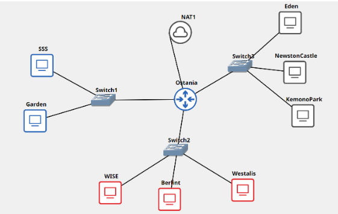
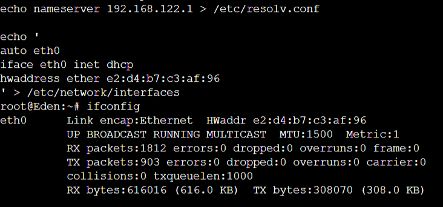

# Jarkom-Modul-3-ITB09-2022

Laporan Resmi Praktikum Jaringan Komunikasi Modul 3

---

## Anggota Kelompok
Nama | NRP
--- | ---
Rama Muhammad Murshal | 5027201041
Satrio Kamil Widhiwoso | 5027201051
Fairuz Azhar Auzan | 5027201059

## Daftar Isi
- [Soal 1](#soal-1)
- [Soal 2](#soal-2)
- [Soal 3 dan 4](#soal-3-dan-4)
- [Soal 5](#soal-5)
- [Soal 6](#soal-6)
- [Soal 7](#soal-7)
- [Soal 8](#soal-8)

---

## Topologi


---
### Soal 1
Loid bersama Franky berencana membuat peta tersebut dengan kriteria WISE sebagai DNS Server, Westalis sebagai DHCP Server, Berlint sebagai Proxy Server.

### Jawaban
**WISE**

```
echo nameserver 192.168.122.1 > /etc/resolv.conf

apt-get update
apt-get install bind9 -y
```

**Westalis**

```
echo nameserver 192.168.122.1 > /etc/resolv.conf

apt-get update
apt-get install isc-dhcp-server
```

**Berlint**

```
echo nameserver 192.168.122.1 > /etc/resolv.conf

apt-get update
apt-get install squid
```
---

### Soal 2
Ostania sebagai DHCP Relay

### Jawaban
**Ostania**

```
apt-get update
apt-get install isc-dhcp-relay -y
```
---
### Soal 3 dan 4
Client yang melalui Switch1 mendapatkan range IP dari [prefix IP].1.50 - [prefix IP].1.88 dan [prefix IP].1.120 - [prefix IP].1.155. Client yang melalui Switch3 mendapatkan range IP dari [prefix IP].3.10 - [prefix IP].3.30 dan [prefix IP].3.60 - [prefix IP].3.85

**Westalis**

```
echo INTERFACES="eth0" > /etc/default/isc-dhcp-server

echo '
subnet 10.49.2.0 netmask 255.255.255.0 {
}
subnet 10.49.1.0 netmask 255.255.255.0 {
    range  10.49.1.50 10.49.1.88;
    range  10.49.1.120 10.49.1.155;
    option routers 10.49.1.1;
    option broadcast-address 10.49.1.255;
    option domain-name-servers 10.49.2.2;
    default-lease-time 300;
    max-lease-time 6900;
}
subnet 10.49.3.0  netmask 255.255.255.0 {
    range 10.49.3.10 10.49.3.30;
    range 10.49.3.60 10.49.3.85;
    option routers 10.49.3.1;
    option broadcast-address 10.49.1.255;
    option domain-name-servers 10.49.2.2;
    default-lease-time 600;
    max-lease-time 6900;
}
' >> /etc/dhcp/dhcpd.conf

service isc-dhcp-server restart
```

---
### Soal 5
Client mendapatkan DNS dari WISE dan client dapat terhubung dengan internet melalui DNS tersebut.

### Jawaban
**Client**

```
echo nameserver 192.168.122.1 > /etc/resolv.conf
```

---
### Soal 6
Lama waktu DHCP server meminjamkan alamat IP kepada Client yang melalui Switch1 selama 5 menit sedangkan pada client yang melalui Switch3 selama 10 menit. Dengan waktu maksimal yang dialokasikan untuk peminjaman alamat IP selama 115 menit.

### Jawaban
**Switch 1**
```
default-lease-time 300
max-lease-time 6900;
```

**Switch 2**
```
default-lease-time 600;
max-lease-time 6900;
```

---
### Soal 7
Loid dan Franky berencana menjadikan Eden sebagai server untuk pertukaran informasi dengan alamat IP yang tetap dengan IP [prefix IP].3.13

### Jawaban
**Eden**
```
echo '
auto eth0
iface eth0 inet dhcp
hwaddress ether e2:d4:b7:c3:af:96
' > /etc/network/interfaces
```
`e2:d4:b7:c3:af:96` adalah hwaddress dari Eden



---

### Ketentuan Proxy
1. Client hanya dapat mengakses internet diluar (selain) hari & jam kerja (senin-jumat 08.00 - 17.00) dan hari libur (dapat mengakses 24 jam penuh)

2. Adapun pada hari dan jam kerja sesuai nomor (1), client hanya dapat mengakses domain loid-work.com dan franky-work.com (IP tujuan domain dibebaskan)

3. Saat akses internet dibuka, client dilarang untuk mengakses web tanpa HTTPS. (Contoh web HTTP: http://example.com)

4. Agar menghemat penggunaan, akses internet dibatasi dengan kecepatan maksimum 128 Kbps pada setiap host (Kbps = kilobit per second; lakukan pengecekan pada tiap host, ketika 2 host akses internet pada saat bersamaan, keduanya mendapatkan speed maksimal yaitu 128 Kbps)

5. Setelah diterapkan, ternyata peraturan nomor (4) mengganggu produktifitas saat hari kerja, dengan demikian pembatasan kecepatan hanya diberlakukan untuk pengaksesan internet pada hari libur


Setelah proxy Berlint diatur oleh Loid, dia melakukan pengujian dan mendapatkan hasil sesuai tabel berikut.


|                   Aksi                  |   Senin (10.00)  |       Senin (20.00)      | Sabtu (10.00) |
|:---------------------------------------:|:----------------:|:------------------------:|:-------------:|
| Akses internet (HTTP)                   |         x        |             x            |       x       |
| Akses internet (HTTPS)                  |         x        |             v            |       v       |
| Akses loid-work.com dan franky-work.com |         v        |             x            |       x       |
| Speed limit (128Kbps)                   | Tidak bisa akses | x (Speed Tidak Dibatasi) |       x       |

### Jawaban
1. Pada Berlint, edit `acl.conf` menjadi 
```
acl AVAILABLE_WORKING time MTWHF 00:00-07:59
acl AVAILABLE_WORKING time MTWHF 17:01-23:59
acl AVAILABLE_WORKING time SA 00:00-23:59
```
dan `squid.conf` menjadi 
```
include /etc/squid/acl.conf
http_port 8080
http_access allow AVAILABLE_WORKING
http_access deny all
visible_hostname Berlint
```

2. Pada `squid.conf` tambahkan 
```
acl loid dstdomain loid-work.com
acl franky dstdomain franky-work.com
http_access allow loid
http_access allow franky
```